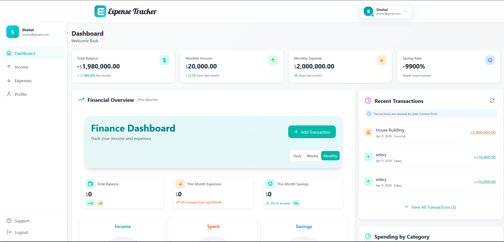

# 💰 Expense Tracker

A full-stack personal finance management application built with the **MERN stack** (MongoDB, Express, React, Node.js). Track your income, manage expenses, and get real-time insights into your financial health through a clean, modern dashboard.

---

## 📸 Preview



---

## 🔥 What It Does

| Feature | Description |
|---------|-------------|
| **Dashboard** | Total balance, monthly income/expenses, savings rate, spending by category, recent transactions — all at a glance |
| **Income Tracking** | Record salary, freelance, investment, and other income sources with date, amount, and category |
| **Expense Management** | Log and manage expenses across categories like Food, Housing, Transport, Shopping, Entertainment, etc. |
| **Visual Analytics** | Interactive area charts, bar charts, and pie charts to visualize your spending patterns over time |
| **Profile & Security** | Update your name, email, and password with smooth animated form transitions |
| **Auth System** | Secure registration and login using JWT-based authentication with "Remember Me" support |

---

## 🛠️ Tech Stack

### Frontend
| Technology | Role |
|------------|------|
| **React 18** | Component-based UI with modern hooks |
| **Vite** | Lightning-fast dev server & optimized production builds |
| **Tailwind CSS** | Utility-first styling with custom design tokens |
| **Framer Motion** | Smooth page transitions, staggered lists, hover effects |
| **Recharts** | Responsive area, bar, and pie chart visualizations |
| **Lucide React** | Clean, consistent iconography throughout the app |
| **Axios** | HTTP client for all API communication |
| **React Router v6** | Client-side routing with nested layouts |
| **React Toastify** | Elegant toast notifications for user feedback |

### Backend
| Technology | Role |
|------------|------|
| **Node.js + Express** | RESTful API server |
| **MongoDB + Mongoose** | NoSQL database with schema modeling |
| **JWT** | Stateless token-based authentication |
| **Bcrypt.js** | Secure password hashing |

---

## 🚀 Quick Start

### 1. Clone the repo
```bash
git clone <your-repo-url>
cd expense-tracker
```

### 2. Setup & start the backend
```bash
cd backend
npm install
```

Create a `.env` file inside `backend/`:
```env
MONGO_URI=your_mongodb_connection_string
JWT_SECRET=your_secret_key
PORT=8000
```

```bash
npm start
```
> Backend runs at **http://localhost:8000**

### 3. Setup & start the frontend
```bash
cd frontend
npm install
npm run dev
```
> Frontend runs at **http://localhost:5173**

---

## 📡 API Endpoints

### 🔐 Authentication
| Method | Route | Description |
|--------|-------|-------------|
| `POST` | `/api/user/register` | Create a new account |
| `POST` | `/api/user/login` | Login & receive JWT token |
| `GET` | `/api/user/me` | Get current user profile |
| `PUT` | `/api/user/profile` | Update name & email |
| `PUT` | `/api/user/password` | Change password |

### 💵 Income
| Method | Route | Description |
|--------|-------|-------------|
| `GET` | `/api/income/get` | Fetch all income records |
| `POST` | `/api/income/add` | Add a new income |
| `PUT` | `/api/income/update/:id` | Update an income record |
| `DELETE` | `/api/income/delete/:id` | Delete an income record |

### 💸 Expense
| Method | Route | Description |
|--------|-------|-------------|
| `GET` | `/api/expense/get` | Fetch all expense records |
| `POST` | `/api/expense/add` | Add a new expense |
| `PUT` | `/api/expense/update/:id` | Update an expense record |
| `DELETE` | `/api/expense/delete/:id` | Delete an expense record |

---

## 📂 Project Structure

```
expense-tracker/
│
├── frontend/                   # React + Vite application
│   ├── src/
│   │   ├── components/         # Layout, Navbar, Sidebar, Login, SignUp, Add modal, TransactionItem
│   │   ├── pages/              # Dashboard, Income, Expense, Profile
│   │   ├── assets/             # Images, centralized styles (dummyStyles.js), color config
│   │   ├── context/            # PreferencesContext (currency, display settings)
│   │   └── utils/              # Currency formatting helpers
│   ├── index.html
│   ├── tailwind.config.js
│   ├── vite.config.js
│   └── vercel.json             # SPA routing for Vercel deployment
│
├── backend/                    # Node.js + Express API
│   ├── controller/             # Business logic for each route
│   ├── models/                 # Mongoose schemas (User, Income, Expense)
│   ├── routes/                 # Route definitions
│   ├── middleware/             # JWT auth middleware
│   ├── config/                 # Database connection
│   ├── server.js               # Entry point
│   └── vercel.json             # Serverless config for Vercel
│
└── README.md
```

---

## ☁️ Deployment (Vercel)

Both frontend and backend are configured for **Vercel** out of the box:

1. **Backend** — Create a Vercel project, set root directory to `backend/`, add `MONGO_URI` and `JWT_SECRET` as environment variables
2. **Frontend** — Create a separate Vercel project, set root directory to `frontend/`
3. **Connect** — Add `VITE_API_BASE_URL=https://your-backend.vercel.app` as an env var in the frontend project

---

## 👨‍💻 Author

**shoriful-dev** — Full Stack Developer

---
